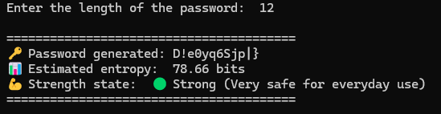

# Password Generator with Entropy Strength Meter

A Python application that generates secure random passwords and evaluates their strength using entropy calculations.

The project classifies each generated password into different security levels, helping users understand how resistant their password is to brute-force attacks.

# Features

* Generate random passwords
* Customizable password length
* Support for:

  * Uppercase letters
  * Lowercase letters
  * Numbers
  * Special characters
* Entropy calculation (bits)
* Password strength classification
* Easy-to-use command-line interface

## Password Strength Levels

The generated password is classified according to its entropy, for example:

|    Entropy | Strength    |
| ---------: | ----------- |
|  < 40 bits | Very Weak   |
| 40–59 bits | Weak        |
| 60–79 bits | Moderate    |
| 80–99 bits | Strong      |
|  ≥100 bits | Very Strong |

*(Thresholds may vary depending on the implementation.)*

## Technologies

* Python 3

* Standard Python libraries
* `math` `random` / `secrets`

# Example

# Purpose

This project was developed to practice Python programming, randomness, entropy calculation, and basic cybersecurity concepts.
